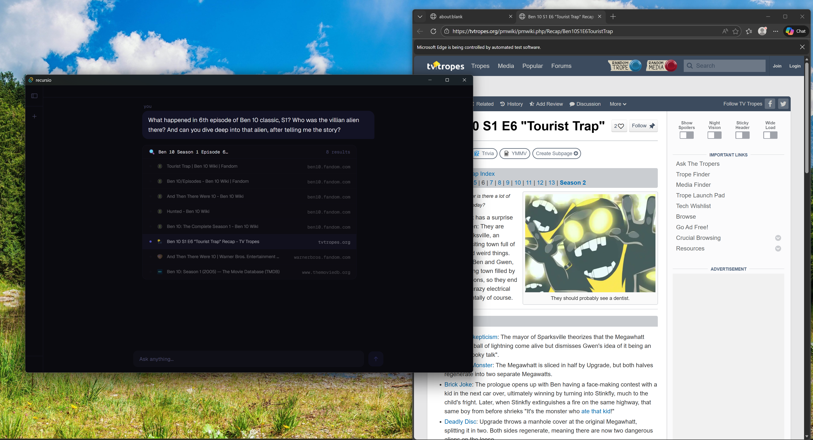
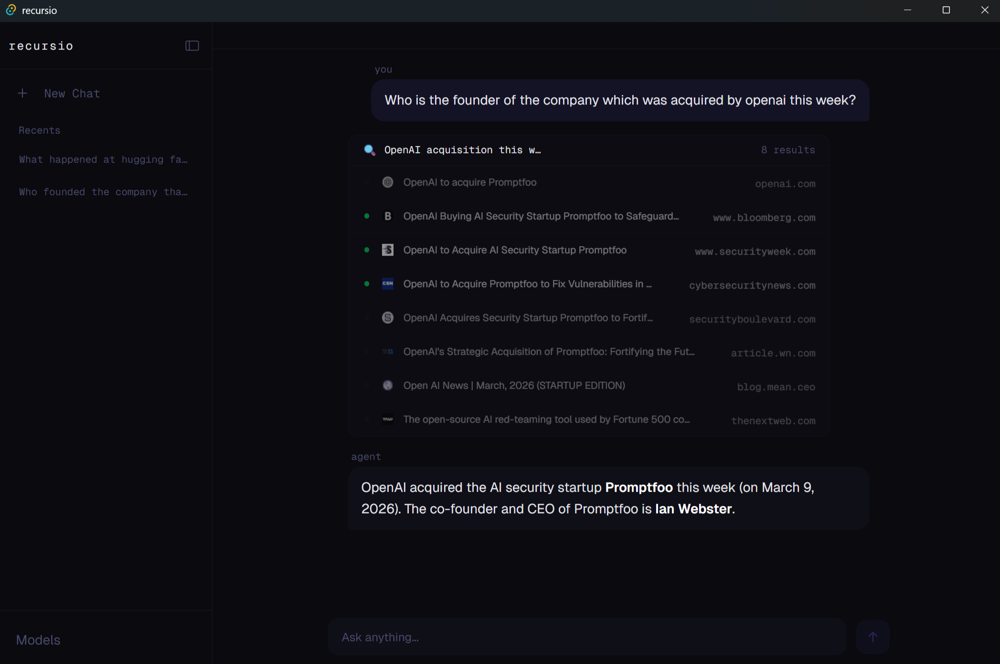
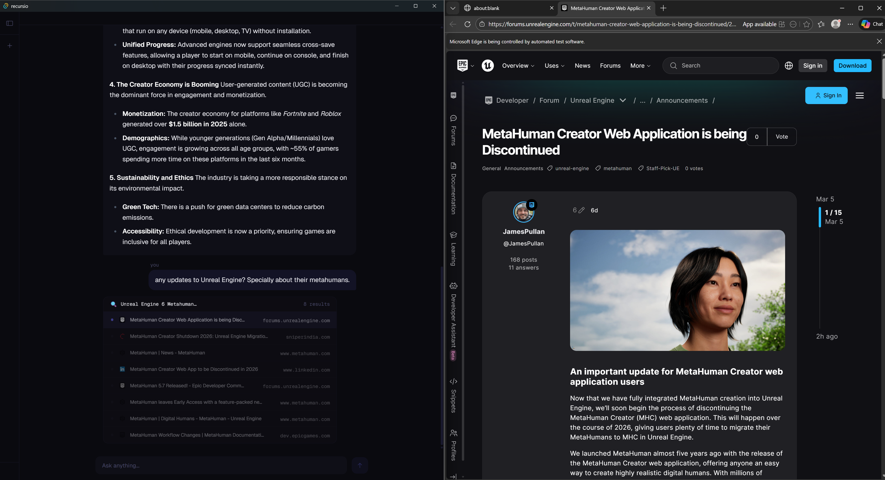

# recursio

**private ai with internet access.**

Built with Rust + Tauri + SvelteKit. Uses [llama.cpp](https://github.com/ggml-org/llama.cpp) under the hood. Powered by [Qwen's 3.5 Series](https://huggingface.co/collections/Qwen/qwen35)


https://github.com/user-attachments/assets/ab075e26-8777-45bf-abe9-2d06e9fba879


<p align="center">
    
    
     
</p>

---

## What it does

Recursio is a desktop AI assistant that can browse the web to answer your questions, entirely on device. No cloud, no API keys, no data leaving your machine.

When you ask it something, it:
1. Searches the web via DuckDuckGo
2. Ranks the results using the model
3. Visits the best pages with a real browser
4. Extracts and synthesizes the answer across sources

You see every step happening in real time.

---

## Features

- 🔒 **Fully Private** — Runs 100% on your machine
- 🌐 **Real Web Browsing** — Not just search snippets, it actually visits pages
- 🔍 **Transparent Search UI** — Watch the AI visit web pages and read them.
- 🦀 **Built in Rust** — Fast and Memory safe

---

## Models

| model | size | vram | best for | powered by |
|-------|------|------|----------| ---------- |
| Recursio Base | 2.6 GB | ≥ 6 GB | everyday tasks | Qwen3.5-4B
| Recursio Pro | 5.3 GB | ≥ 12 GB | complex reasoning | Qwen3.5-9B
| Recursio Ultra | 20.5 GB | ≥ 24 GB | research, hard problems | Qwen3.5-35B-A3B

---

## Setup

### prerequisites

- [Rust](https://rust-lang.org/)
- [Node.js](https://nodejs.org/)
- [Tauri prerequisites](https://tauri.app/start/prerequisites/) for your platform

### Building from Source

```bash
git clone https://github.com/inventwithdean/recursio
cd recursio
npm install
npm run tauri dev
```

> **Note:** llama-server binaries for Windows are included in `src-tauri/binaries/`. For other platforms, download the appropriate `llama-server` binary from the [llama.cpp releases](https://github.com/ggml-org/llama.cpp/releases/latest) and place it in `src-tauri/binaries/` with the correct Tauri target triple name.

---

## Tech Stack

- **Frontend:** SvelteKit + TypeScript + TailwindCSS
- **Backend:** Rust + Tauri
- **Inference:** llama.cpp
- **Browser automation:** chromiumoxide
- **Database:** SQLite (rusqlite)

---

## Known limitations

- Context window is hardcoded to 8192 tokens
- Windows only (for now — binaries for other platforms coming)
- Early release, expect rough edges

---

## Contributing

Issues and PRs are very welcome. This is a young project and there's a lot of room to grow.

---

## License

MIT — see [LICENSE](./LICENSE)
